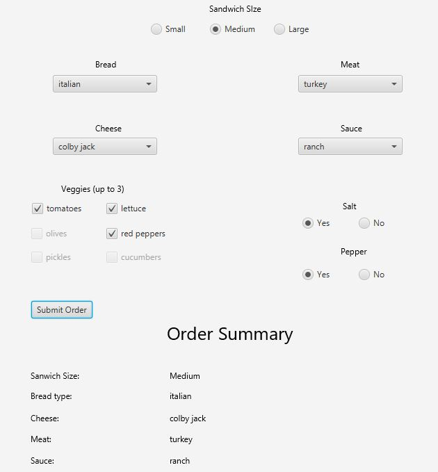

# Subway Ordering System

The application will be an automated Ordering System for Subway. It will use a GUI to interact with the user. A user chooses:

Size of sandwich
Type of bread
Type of meat
Type of cheese
Up to three veggies
Type of Sauce
Salt & Pepper (Y/N)
A summary display shows all of the options chosen by the user.

## Example Output




## Analysis Steps

We analyzed the requirements by looking at the list given to us on the canvas page. We know that
we need to create a GUI and to create various functions to make our program function like a subway ordering system
we have to use multiple different javafx functions in order to build this project while we also used scenebuilder

### Design

```
public void start(Stage primaryStage) throws Exception{
        Parent root = FXMLLoader.load(getClass().getResource("sample.fxml"));
        primaryStage.setTitle("Sandwich order");
        primaryStage.setScene(new Scene(root, 800, 800));
        primaryStage.show();
    }
```

### Testing

A step by step series of examples that you developed to properly test the program. 

Say what the step will be

```
Give the example
```

And repeat

```
until finished
```

You can use it for a little demo as to what an ordering system would look like
online. You can get information on how they program their online ordering, this
help you in the future programming systems that order.

## Notes

Testing instructions: 
Step 1: User will select bread size.

Step 2: User will select the bread choice of their desire.(Italian, White, Wheat)
Step 3: User will select sandwhich meat for sandwhich.(Peperoni, Turkey, Ham)
Step 4: User will select cheese type. (American, Colby Jack, Cheddar)
Step 5: User selects sauce of their choice. (Ranch, Italian, Mayonnaise)
Step 6: User will select up to 3 veggie choices from our selection to add to sandwhich.

Step 7: User will select if they want Salt and/or Pepper by selecting yes or no.

Step 8: User will submit their order via submit button and recieve a Order Summary at the bottom of the page showing all of their selections for their sandwhich.


(The Order Form will not allow user to submit without choosing atleast one selection from each option.)


## Do not change content below this line
## Adapted from a README Built With

* [Dropwizard](http://www.dropwizard.io/1.0.2/docs/) - The web framework used
* [Maven](https://maven.apache.org/) - Dependency Management
* [ROME](https://rometools.github.io/rome/) - Used to generate RSS Feeds

## Contributing

Please read [CONTRIBUTING.md](https://gist.github.com/PurpleBooth/b24679402957c63ec426) for details on our code of conduct, and the process for submitting pull requests to us.

## Versioning

We use [SemVer](http://semver.org/) for versioning. For the versions available, see the [tags on this repository](https://github.com/your/project/tags). 

## Authors

* **Billie Thompson** - *Initial work* - [PurpleBooth](https://github.com/PurpleBooth)

See also the list of [contributors](https://github.com/your/project/contributors) who participated in this project.

## License

This project is licensed under the MIT License - see the [LICENSE.md](LICENSE.md) file for details

## Acknowledgments

* Hat tip to anyone who's code was used
* Inspiration
* etc
